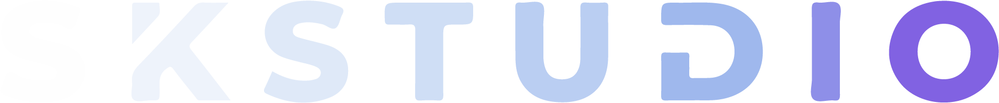

<a name="readme-top"></a>

<!-- PROJECT LOGO -->
<br />
<div align="center">
  <a href="https://github.com/Shivamkak19/SKSTUDIO-Portfolio">
    
  </a>

<h3 align="center">Website Description</h3>

Welcome to my personal portfolio! This website showcases my most important coding projects, all of which are also available here on my Github page. 

<br />

<a href="https://github.com/Shivamkak19/SKSTUDIO-Portfolio/images">View Product</a>
·
<a href="https://github.com/Shivamkak19/SKSTUDIO-Portfolio/issues">Report Bug</a>
·
<a href="https://github.com/Shivamkak19/SKSTUDIO-Portfolio/issues">Request Feature</a>
</div>


<!-- ABOUT THE PROJECT -->
## About the Project

Live Links:

* [skstud.io](https://skstud.io)
* [skstudio.vercel.app](https://skstudio.vercel.app)

[![Product][product1]](https://skstud.io)

This portfolio website is based on the open source React Three Fiber components and templates developed by Pmndrs/drei. Available here: [https://github.com/pmndrs/drei](https://github.com/pmndrs/drei) 

<p align="right">(<a href="#readme-top">back to top</a>)</p>

### Built With

* [![Three.js][threedotjs]][threedotjs-url]
* [![Node.js][nodedotjs]][nodedotjs-url]
* [![GSAP][greensock]][greensock-url]
* [![Vite.js][vite]][vite-url]
* [![Blender][blender]][blender-url]

<p align="right">(<a href="#readme-top">back to top</a>)</p>


<!-- GETTING STARTED -->
## Getting Started

If you are interested in using this as a template to learn React Three Fiber, follow the installation steps below to run this portfolio on your local device. 

** (Please do not copy this content directly without citing for the purpose of your own portfolio). ** 

### Prerequisites

To run this project, you must download the latest version of the npm package manager and Blender 3.6.1.

  ```sh
  npm install npm@latest -g
  ```


### Installation

1. Clone the repo
   ```sh
   git clone https://github.com/Shivamkak19/SKSTUDIO-Portfolio.git
   ```

2. Install NPM packages
   ```sh
   npm install
   ```

3. Vite local deployment
   ```sh
   npm run dev
   ```

4. Vite build
   ```sh
   npm run build
   ```

5. Vite preview
   ```sh
   npm run preview
   ```
   
<p align="right">(<a href="#readme-top">back to top</a>)</p>

<!-- ROADMAP -->
## Roadmap

- [ ] Use Pmdnrs/drei "Ground reflections and video textures" as template
- [ ] Utilize HTML React component to create information panels for each project
    - [ ] Assign component to a plane mesh for effect
- [ ] Import polar bears models as GLB files
    - [ ] Set animation mixer for polar bear animations
- [ ] Design scroll experience with GSAP scroll trigger plug in

See the [open issues](https://github.com/Shivamkak19/SKSTUDIO-Portfolio/issues) for a full list of proposed features (and known issues).

<p align="right">(<a href="#readme-top">back to top</a>)</p>


<!-- LICENSE -->
## License

Distributed under the MIT License. See `LICENSE` for more information.

<p align="right">(<a href="#readme-top">back to top</a>)</p>


<!-- CONTACT -->
## Contact

* Shivam Kak: [Email](sk3686@princeton.edu) [linkedIn](https://linkedin.com/in/shivamkak)
* Project Link: [https://github.com/Shivamkak19/SKSTUDIO-Portfolio](https://github.com/Shivamkak19/SKSTUDIO-Portfolio)

<p align="right">(<a href="#readme-top">back to top</a>)</p>


<!-- ACKNOWLEDGMENTS -->
## Acknowledgments

* []() Pmndrs/drei, for a really cool template with preset ground reflections and video textures for text!
* []() Bruno Simon, for the Three JS Journey course, which is a great instructional resource for learning three.js and React Three Fiber

<br />
 "Polar Bear" model by Bjarne Stokhof can be found at https://sketchfab.com/3d-models/polar-bear-04dbccf27a694c8a82e5330f3056022f

<p align="right">(<a href="#readme-top">back to top</a>)</p>


<!-- MARKDOWN LINKS & IMAGES -->
<!-- https://www.markdownguide.org/basic-syntax/#reference-style-links -->
[product1]: public/skstudio-logo.png
[product2]: public/product2.jpg
[product3]: public/product3.jpg

<!-- Programming Language Shields -->
[threedotjs]:  https://img.shields.io/badge/Three.js-6592e6?style=for-the-badge&logo=threedotjs&logoColor=000000
[threedotjs-url]: https://threejs.org/

[nodedotjs]: https://img.shields.io/badge/Node.js-333333?style=for-the-badge&logo=nodedotjs&logoColor=3f873e
[nodedotjs-url]: https://nodejs.org/en

[greensock]: https://img.shields.io/badge/GSAP-88ce02?style=for-the-badge&logo=greensock&logoColor=000000
[greensock-url]: https://greensock.com/gsap/

[vite]: https://img.shields.io/badge/Vite.js-ac49fe?style=for-the-badge&logo=vite&logoColor=ffd52e
[vite-url]: https://vitejs.dev/

[blender]: https://img.shields.io/badge/Blender-165a8f?style=for-the-badge&logo=blender&logoColor=f4792b
[blender-url]: https://www.blender.org/
